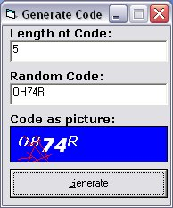



## Bot Prevention \- Human\-only Readable Text

### Description

An interesting and simple program to demonstrated how bot prevention pictures are made (like the vote one on this site ;-) ). Also included is a new feature that would further confuse any OCR program. I have included extensive comments to try and make it as clear as possible on what’s happening.
 
### More Info
 
I’m not sure if this technique is patented or not, so if it is please contact me ASAP by email at: sic_uk@yahoo.co.uk. Because of this I have not made it executable by a web page script, however if it is not patented I will create another program for use in a web page!

If you find it useful or rubbish, please be courteous and vote+comment please!

             |
---                |---
**Submitted On**   |2003-05-17 13:25:04
**By**             |[Simon Chambers](https://github.com/Planet-Source-Code/PSCIndex/blob/master/ByAuthor/simon-chambers.md)
**Level**          |Advanced
**User Rating**    |5.0 (45 globes from 9 users)
**Compatibility**  |VB 5\.0, VB 6\.0
**Category**       |[Miscellaneous](https://github.com/Planet-Source-Code/PSCIndex/blob/master/ByCategory/miscellaneous__1-1.md)
**World**          |[Visual Basic](https://github.com/Planet-Source-Code/PSCIndex/blob/master/ByWorld/visual-basic.md)
**Archive File**   |[Bot\_Preven1588955172003\.zip](https://github.com/Planet-Source-Code/simon-chambers-bot-prevention-human-only-readable-text__1-45544/archive/master.zip)

